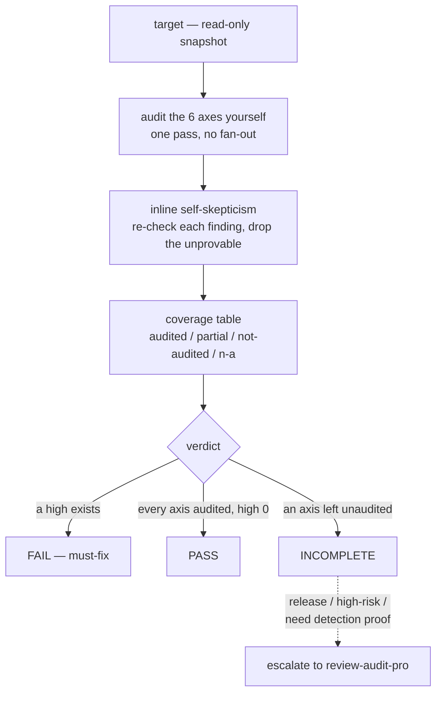
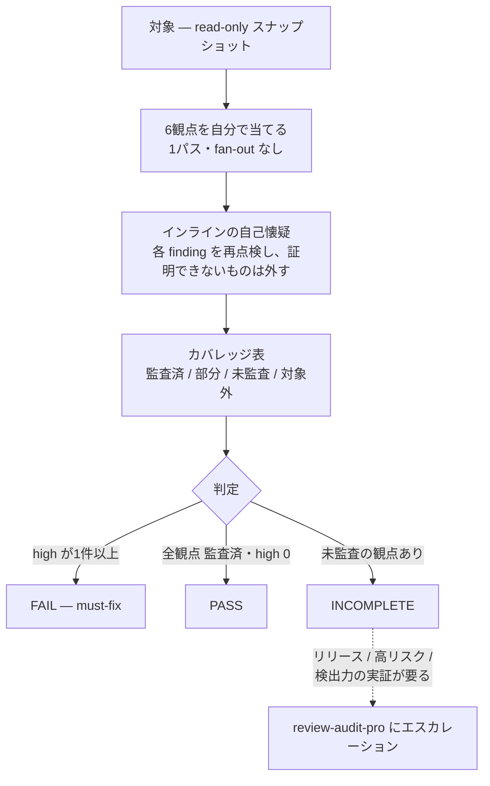

<h1 align="center">review-audit</h1>

<p align="center">
  <strong>A fast, single-pass code audit that refuses to fake a PASS.</strong><br>
  速くて低コスト、それでも「偽の合格」を出さない1パス監査。
</p>

<p align="center">
  <a href="LICENSE"></a>
  <a href="https://docs.claude.com/en/docs/claude-code"></a>
  
  
</p>

<p align="center">
  A read-only, all-axis code-audit <strong>skill for <a href="https://docs.claude.com/en/docs/claude-code">Claude Code</a></strong>.<br>
  The everyday, low-token tier. For the exhaustive, benchmarked tier, see
  <a href="https://github.com/dualform-labs/review-audit-pro-v1"><code>review-audit-pro</code></a>.
</p>

<p align="center">Built and maintained by <a href="https://github.com/dualform-labs">dualform-labs</a> · <a href="#english">English</a> · <a href="#日本語">日本語</a></p>

---

## At a glance

| | |
|---|---|
| **6 axes, one read-only pass** | bugs · wiring · security · tests · spec · regression |
| **low token, no fan-out** | the calling agent audits in its own context — no sub-agents |
| **no false PASS** | an axis is `audited` only with concrete `file:line` + grep/run evidence |
| **1 file, 0 dependencies** | the whole skill is one prompt — `skills/review-audit/SKILL.md` |
| **escalates, never bloats** | hands off to `review-audit-pro` when a change needs more than one pass |

---

## English

### What it is

`review-audit` runs a **single-pass** audit over your change in the **calling agent's own context** — no sub-agent fan-out, no extra orchestration — so it costs a fraction of a multi-agent review while keeping the discipline that matters.



- **Six axes, one pass**: correctness/bugs · wiring (anti-Potemkin: built-but-never-called, dead code) · security · test efficacy · spec compliance · regression (tests/build actually run).
- **No false PASS**: an axis can only be marked `audited` if the report shows the concrete command / grep / `file:line` evidence behind it. "I didn't check" is a first-class output, not a silent gap.
- **Coverage honesty**: every axis reports `audited / partial / not-audited / n-a`; an unexamined axis can never be part of a `PASS`.
- **Read-only, always**: it proposes fixes, never applies them — a before/after checksum proves your tree is untouched.
- **Evidence over vibes**: findings ride a `file:line` + the grep/run output that proves them. Regression and wiring can't PASS on "looks fine" — only on a real run's exit code.

It is deliberately cheap. When a change needs more than one pass can give, it **escalates** rather than bloating itself.

### When to use which tier

| | **review-audit** (this repo) | [**review-audit-pro**](https://github.com/dualform-labs/review-audit-pro-v1) |
|---|---|---|
| cost | low — single pass, no sub-agents | high — multi-agent fan-out |
| use for | everyday "before I say done" checks | release gates, high-risk changes, publishing |
| adversarial verification | inline self-skepticism (one pass) | fresh-context refuters per finding |
| live self-calibration (per-run detection proof) | — | yes |
| benchmarked numbers | none claimed (does not inherit pro's) | 95.6% recall / 2.5% hallucination, reproducible |

`review-audit` tells you, in its own output, when to escalate to `review-audit-pro` (release/publish, high-risk, large surface, or when you need per-run proof that it can catch the class of bug it's looking for).

### Install

One prompt file, no runtime dependencies.

```bash
git clone https://github.com/dualform-labs/review-audit.git
cp -r review-audit/skills/review-audit ~/.claude/skills/
```

Then in Claude Code: `/review-audit [target]`, or let the agent invoke it before declaring a non-trivial change `done`.

**Output language** is configurable in `skills/review-audit/config.yml` (`auto` / `ja` / `en`) — it controls the report's prose and labels; code, commands, and `file:line` always stay in English.

### What it does not claim

It does not carry a benchmark. Single-pass detection is model-dependent and lighter than the pro pipeline; if you need *proven* detection power or the lowest false-positive rate, use [`review-audit-pro`](https://github.com/dualform-labs/review-audit-pro-v1), whose numbers are measured and reproducible. This tier optimizes for **honesty per token**: cheap, read-only, and structurally unable to report a PASS it didn't verify.

### License

[Apache License 2.0](LICENSE) · see [NOTICE](NOTICE).

---

## 日本語

### これは何か

`review-audit` は、あなたの変更を **呼び出し側エージェント自身のコンテキスト** で **1パス** 監査します — サブエージェントの fan-out も追加のオーケストレーションもなし。だから多エージェントレビューのほんの一部のコストで、肝心の規律は保ちます。



- **6観点を1パスで**: 正しさ/バグ · 配線(anti-Potemkin: 作ったが呼ばれない・dead code)· セキュリティ · テスト実効性 · spec 準拠 · 回帰(テスト/ビルドを実際に走らせる)。
- **偽の PASS なし**: ある観点を `監査済` にできるのは、その根拠となる具体的なコマンド / grep / `file:line` をレポートが示せたときだけ。「調べなかった」は黙った隙間ではなく、一級の出力です。
- **カバレッジの正直さ**: 各観点が `監査済 / 部分 / 未監査 / 対象外` を報告します。調べていない観点は、決して `PASS` の一部になれません。
- **常に read-only**: 修正案は出しますが、適用はしません — 監査前後の checksum で、あなたのツリーが無傷だと証明します。
- **雰囲気より証拠**: finding は `file:line` と、それを裏づける grep/実行の出力を伴います。回帰と配線は「大丈夫そう」では PASS できません — 実際に走らせた exit code だけが証拠です。

意図的に安く作っています。1パスで足りない変更には、自分を肥大化させるのではなく **エスカレーション** します。

### どちらの階層を使うか

| | **review-audit**(本リポ) | [**review-audit-pro**](https://github.com/dualform-labs/review-audit-pro-v1) |
|---|---|---|
| コスト | 低 — 1パス・サブエージェントなし | 高 — 多エージェント fan-out |
| 用途 | 日常の「done と言う前」チェック | リリースゲート・高リスク変更・公開 |
| 敵対検証 | インラインの自己懐疑(1パス) | finding ごとに fresh-context の反証エージェント |
| ライブ自己校正(per-run の検出力実証) | — | あり |
| ベンチ数値 | 主張しない(pro のものは継承しない) | recall 95.6% / hallucination 2.5%・再現可能 |

`review-audit` は自分の出力の中で、いつ `review-audit-pro` にエスカレーションすべきか(リリース/公開・高リスク・大規模・検出力の per-run 実証が要るとき)を伝えます。

### インストール

プロンプトファイル1つ、実行依存なし。

```bash
git clone https://github.com/dualform-labs/review-audit.git
cp -r review-audit/skills/review-audit ~/.claude/skills/
```

あとは Claude Code で `/review-audit [対象]`、または non-trivial な変更を `done` と宣言する前にエージェントに呼ばせます。

**出力言語**は `skills/review-audit/config.yml`(`auto` / `ja` / `en`)で設定できます — レポートの地の文とラベルを制御します。コード・コマンド・`file:line` は常に英語です。

### 主張しないこと

ベンチマークは持ちません。1パスの検出はモデル依存で、pro パイプラインより軽い。*実証された* 検出力や最低の偽陽性率が要るなら、計測・再現可能な数値を持つ [`review-audit-pro`](https://github.com/dualform-labs/review-audit-pro-v1) を使ってください。この階層は **トークンあたりの正直さ** に最適化しています — 安く、read-only で、検証していない PASS を構造的に報告できません。

### ライセンス

[Apache License 2.0](LICENSE) · [NOTICE](NOTICE) を参照。
